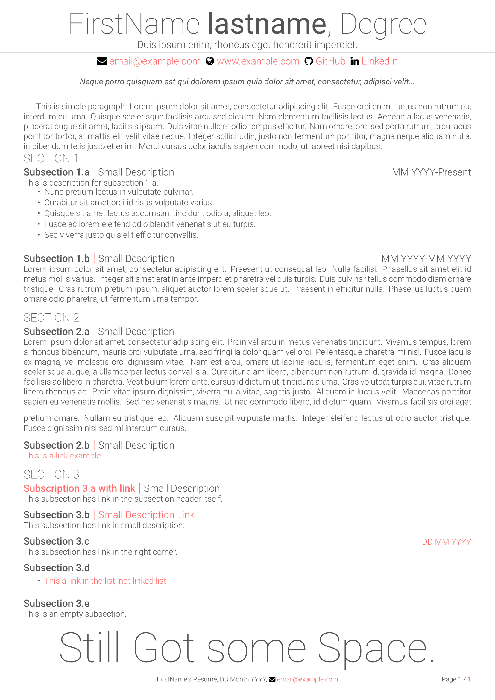

# Compact and Minimal Resume Template

This CV(Resume) template is compact, minimal, easy to modify and beautiful the same time. This template is created according to the job requirements of engineers. See [example](example.pdf) below.



## How to use this template ?

If you are new to LaTeX, use the [example.tex](example.tex) file to start with. 

There are a lots of custom commands and environments to make this resume template easy to use.
- Name and Qualification (academic degree). *(required)*

    ```tex
        \fullname{FirstName}{LastName}{Degree}
    ```

- Resume Title - To be shown below the name *(optional)*

    ```tex
        \cvtitle{Your Resume Title}
    ```

- Email ID *(required)*

    ```tex
        \email{email@example.com}
    ```

- Website/Portfolio *(optional)*

    ```tex
        \website{https://www.example.com}{Website Text}
    ```

- GitHub *(Optional)*

    ```tex
        \github{https://github.com/username}{GitHub Text}
    ```

- LinkedIn *(Optional)*

    ```tex
        \github{https://www.linkedin.com/in/username}{LinkedIn Text}
    ```

- Current Date(any format) *(required)*

    ```tex
        \currentdate{DD Month YYYY}
    ```

- Sections - Create sections

    ```tex
        \section{Section Name}
    ```

- Combo Sections - Subsection with details

    ```tex
        \combosection{Subsection Name}{Location/Extra Info}{Duration}{
            Desciption
        }
    ```

- Tight List Environment - to create compact bulleted list

    ```tex
        \begin{tightlist}
            \item itemA
            \item itemB
        \end{tightlist}

- Extend for a verbose resume - you can put all description at once and compile either full or compact version, default is compact. To compile full version add `extended` in `\documentclass`. 

    ```tex
        \ifextended
            This is the full content.
        \else
            This is compact content.
        \fi
    ```

- You can also use *fontawesome* icons.  For list of available icons check [here](https://mirror.unpad.ac.id/ctan/fonts/fontawesome/doc/fontawesome.pdf#section.4).

    ```tex
        \faicon{icon-name} % you can also use direct icon commands
    ```

## Requirement(s)
You must compile this resume with `XeTeX`, `XeLaTex`, `LuaTeX` or `LuaLaTeX`. *(pdfLaTex is incompatible with fontawesome)*

This resume template uses following extra packages:-
- [fontawesome](https://ctan.org/pkg/fontawesome) - For fontawesome icons
- [xcolor](https://ctan.org/pkg/xcolor) - Custom coloring
- [fontspec](https://ctan.org/pkg/fontspec) - Custom font selection 
- [fancyhdr](https://ctan.org/pkg/fancyhdr) - Custom header and footer design
- [titlesec](https://ctan.org/pkg/titlesec) - Format sections, subsections, chapters
- [hyperref](https://ctan.org/pkg/hyperref) - Link and pdf options
- [geometry](https://ctan.org/pkg/geometry) - Document dimensioning 

In addition to packages, [Roboto](https://fonts.google.com/specimen/Roboto) font family is required. *(Fonts are bundled with the project)*


## License

Copyright 2021 Avinal Kumar
This work may be distributed and/or modified under the conditions of the [LaTeX Project Public License](https://www.latex-project.org/lppl/lppl-1-3c/), either version 1.3 of this license any later version.

## Acknowledgements

This resume template is inspired by [Alessandro Rossini's Adaptive CV](https://www.overleaf.com/latex/templates/adaptive-cv/vfngmmqpmmsb) , [Debarghya Das's Deedy CV](https://www.latextemplates.com/template/deedy-resume-cv) and [Font Awesome](https://fontawesome.com/) icons.
